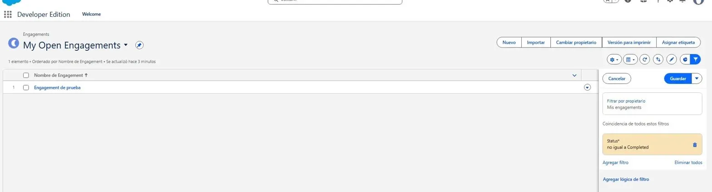
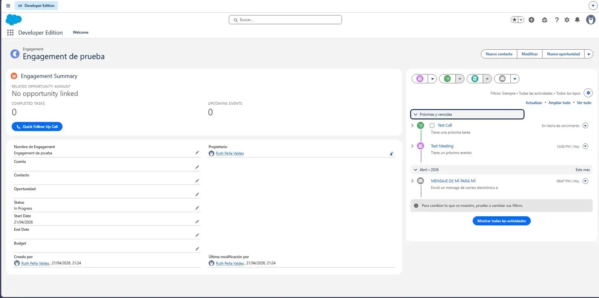
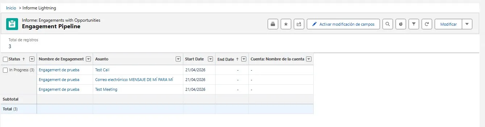
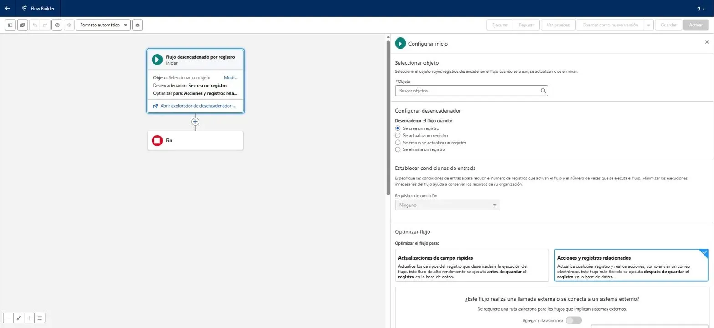

# Acme Services – Engagement Tracker (Developer Assessment)

## What was built
A vertical slice for managing consulting Engagements in Salesforce, including:
a custom object, activities, a Lightning record page, list views, a custom
LWC with Apex, a Flow automation, and a report with a chart.

## Setup & Testing Guide

### #3 – Activities
Open any Engagement record. Use the Activity Timeline to log a Call 
(New Task → Type: Call), send an Email, and create an Event.
📸 SCREENSHOT: Engagement record showing Test Call, Test Meeting and email in the timeline.

### #4 – Lightning Record Page
The custom record page for Engagement__c is activated as default. It includes
the Highlights Panel, Activity Timeline, Related Lists, and the engagementSummary LWC.
📸 SCREENSHOT: Engagement record page showing the full layout with the Engagement Summary component.

### #5 – List Views
- "My Open Engagements": Filter Status ≠ Completed, Owner = current user.
- "Q Engagements by Account": All records; list view chart = Donut, Sum(Budget) by Account.
📸 SCREENSHOT: Both list views and the donut chart visible.

### #6 – LWC + Apex
Component: force-app/main/default/lwc/engagementSummary/
Apex class: force-app/main/default/classes/EngagementSummaryController.cls

To test: open an Engagement record. The component shows the related Opportunity
Amount, count of completed Tasks, and upcoming Events. Click "Quick Follow-Up Call"
to create a Task due tomorrow.
📸 SCREENSHOT: Engagement Summary component showing the button and stats.

### #7 – Flow
Flow name: "Opportunity Stage - Create Engagement Task"
To test: edit an Opportunity and change Stage to "Negotiation/Review". 
A Task "Prepare proposal" (Priority: High) will be created automatically.
📸 SCREENSHOT: Flow Builder showing the active flow diagram.

### #8 – Report
Report name: "Engagement Pipeline"
Report type: "Engagements with Opportunities" (custom report type)
Chart: Bar – Count by Status
📸 SCREENSHOT: Engagement Pipeline report showing data and bar chart.

## LWC and Apex file paths
- LWC: force-app/main/default/lwc/engagementSummary/
- Apex: force-app/main/default/classes/EngagementSummaryController.cls

## List view names
- My Open Engagements
- Q Engagements by Account